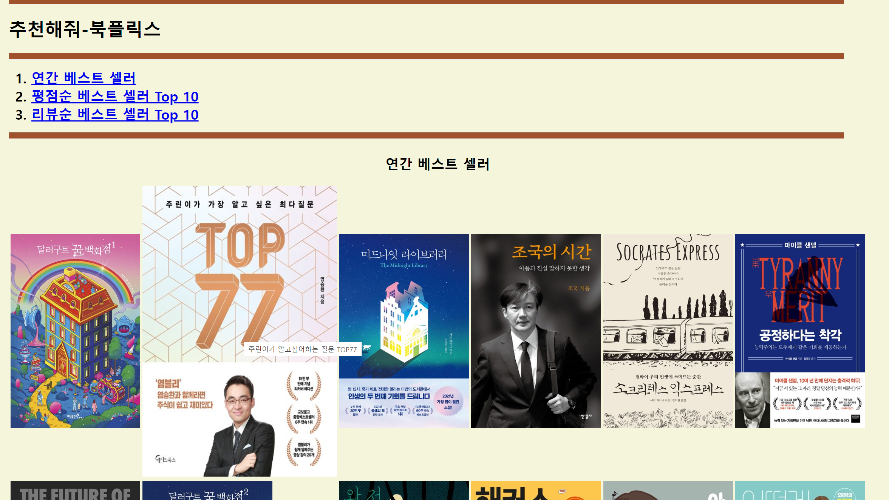
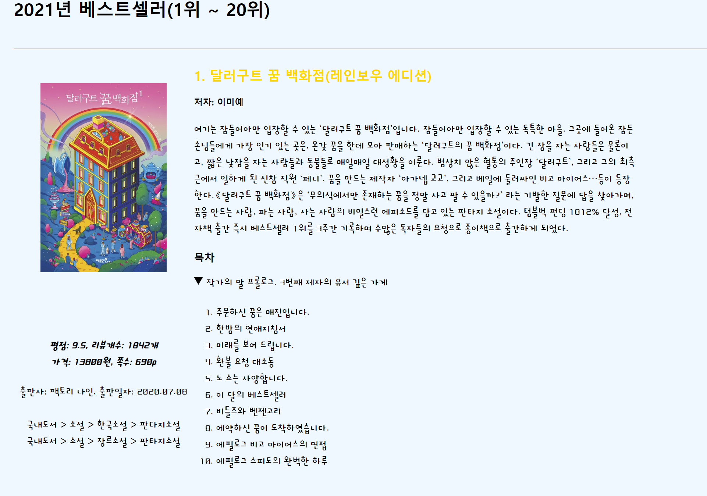

# Bookflix
책을 추천해주는 웹페이지
## Introduction
넷플릭스를 참고하여 넷플릭스와 달리 책을 추천해주는 북플릭스라는 웹사이트를 만들었습니다. 사람들 2021년에 어떤 책을 가장 많이 샀는지를 보여주는 교보문고 연간 베스트 셀러 Top 20, 읽고 나서 후기나 평가가 좋은 평점순, 리뷰순 베스트셀러 Top 10 도서들을 정렬하여 사람들에게 새로운 책을 추천하는 웹페이지를 제작하였습니다.
## Contents
북플릭스 책 소개 프로그램은 사람들이 보기 편하게 디자인해서 한 눈에 베스트셀러들을 볼 수 있게 만들었습니다.
우선 첫 번째 페이지인 책장 페이지에서는 2021년 교보문고 베스트셀러 Top20 도서들과 평점순 베스트셀러 Top 10 도서들, 리뷰순 베스트셀러 Top 10 도서들을 한 눈에 보기 쉽게 만들었습니다.
관심 있는 도서에 마우스를 올리면 title 태그를 활용하여 책의 이름이 나오게 만들었고 자바스크립트를 활용하여 책을 더 자세히 볼 수 있게 확대가 되도록 만들었습니다. 책의 세부정보가 알고 싶다면 책 사진을 클릭하여서 책의 상세한 정보를 알 수 있는 페이지로 이동하게 만들었습니다.

상세 페이지에서는 책의 자세한 정보와 책의 목차를 접고 펼칠 수 있도록 해 책에 대한 정보를 한 눈에 보기 쉽게 만들었습니다. 책을 구매하고 싶을 시 책 사진을 클릭하여 책 구매 페이지로 이동하도록 만들었습니다. 

## Takeaway
상세 페이지를 수업 시간에 배운 table 태그를 활용해서 만들었습니다. 수업 시간에 배운 것을 활용할 수 있어 좋았습니다. table 태그를 하나씩 만들어서 하나의 책장 같은 웹페이지 하나를 만들어졌다는 점이 신기했습니다. table 태그의 여러 가지 속성(rowspan, colspan)에 대해 배웠고 css를 적용하면서 저희가 만든 html 태그 구조(부모, 자식)에 대해 배웠습니다. js를 적용하면서 함수 사용법을 배웠습니다. 더 보완할 시간이 생긴다면 사람들이 더 다양한 책을 볼 수 있도록 책 권수를 늘리고 싶고 평점을 더 잘 볼 수 있도록 progress 태그로 평점을 나타내보고 싶습니다.
